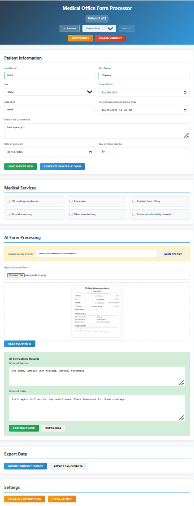

# Medical Office Form Processor

A single-page web application designed for processing patient flow in medical offices, specifically optimized for eye doctor practices. The system handles patient information input, generates printable forms, processes scanned documents with AI, and exports data to JSON.

## Features

- **Patient Management**: Store and navigate between multiple patients with local storage
- **Auto-Load**: Automatically loads and displays the last active patient on startup
- **Printable Forms**: Generate clean, professional forms for doctor use
- **AI Processing**: Use Google Gemini 2.0 Flash API for handwriting recognition
- **Data Export**: Export individual or all patient records to JSON
- **Responsive Design**: Works on desktop and mobile devices
- **Local Storage**: All data persists between browser sessions

## Demo

### Web Application Interface
The main application interface provides a comprehensive patient management system with multiple sections for efficient workflow:



The interface includes:
- **Patient Information Section**: Input fields for patient details, demographics, and appointment information
- **Medical Services Selection**: Checkboxes for common eye care services
- **AI Form Processing**: Upload and process scanned forms with handwriting recognition
- **Navigation Controls**: Easy patient switching and management tools
- **Export Options**: Data export functionality for record keeping

### Print Form with Doctor Notes
The system generates professional, printable forms that doctors can fill out manually during patient visits:


After completion, these forms can be scanned and processed using AI to extract the handwritten information back into the digital system.

## Quick Start

1. **Download Files**: Download all files to a local directory
2. **Open in Browser**: Open `index.html` in a modern web browser
3. **Get API Key**: Obtain a Google Gemini API key from [Google AI Studio](https://aistudio.google.com/app/apikey)
4. **Start Using**: Begin adding patients and processing forms

## Setup Instructions

### Prerequisites
- Modern web browser (Chrome, Firefox, Safari, Edge)
- Internet connection (for AI processing only)
- Google Gemini API key (for AI features)

### Installation
1. Download or clone all project files
2. Ensure all files are in the same directory:
   - `index.html`
   - `styles.css`
   - `script.js`
   - `README.md`

### API Key Setup
1. Visit [Google AI Studio](https://aistudio.google.com/app/apikey)
2. Create a new API key
3. Copy the API key
4. In the application, paste the key in the "Google Gemini API Key" field
5. Click "Save API Key" - it will be stored locally for future use

## Usage Guide

### Patient Management

#### Creating a New Patient
1. Click the "New Patient" button
2. Fill in patient information fields
3. Click "Save Patient Info"

#### Navigating Between Patients
- Use "Previous" and "Next" buttons
- Use the dropdown to select a specific patient
- Patient counter shows current position (e.g., "Patient 3 of 15")

#### Deleting Patients
1. Select the patient to delete
2. Click "Delete Current" button
3. Confirm the deletion

### Patient Information Fields

**Required Fields:**
- Last Name
- First Name

**Optional Fields:**
- Sex
- Date of Birth
- Patient ID
- Current Appointment Date & Time
- Reason for Current Visit
- Date of Last Visit
- Any Overdue Charges

### Medical Services

Select from predefined services:
- UV coating on glasses
- Eye exam
- Contact lens fitting
- Retinal screening
- Glaucoma testing
- Frame selection/adjustment

### Workflow

#### Complete Patient Flow
```
1. Create/Select Patient → 
2. Enter Patient Information → 
3. Select Services → 
4. Generate Printable Form → 
5. [Doctor fills form manually] → 
6. Upload Scanned Image → 
7. AI Processing → 
8. Review Results → 
9. Export Data
```

#### Print Process
1. Complete patient information
2. Click "Generate Printable Form"
3. Review the form preview
4. Click OK to print or Cancel to return
5. Doctor fills out the printed form manually

#### AI Processing
1. After doctor completes the form, scan/photograph it
2. Click "Upload Scanned Form"
3. Select the image file
4. Click "Process with AI"
5. Review extracted information
6. Edit if necessary
7. Click "Confirm & Save"

### Data Export

#### Export Single Patient
1. Select the patient
2. Click "Export Current Patient"
3. File downloads as `FirstName_LastName_YYYY-MM-DD.json`

#### Export All Patients
1. Click "Export All Patients"
2. File downloads as `AllPatients_YYYY-MM-DD.json`

### Settings

#### Clear Data
- **Clear All Patient Data**: Removes all stored patients (API key preserved)
- **Clear API Key**: Removes the saved API key only

## Data Storage

- All data is stored locally in your browser using localStorage
- Data persists between browser sessions
- No data is sent to external servers (except for AI processing)
- Clearing browser data will remove all stored information

## Browser Compatibility

- **Chrome**: Fully supported
- **Firefox**: Fully supported
- **Safari**: Fully supported
- **Edge**: Fully supported
- **Mobile browsers**: Responsive design works on mobile devices

## Security Notes

- API key is stored locally in browser storage
- Patient data never leaves your computer (except during AI processing)
- No HIPAA compliance features - intended for single-computer use
- Consider using in a secure, private environment

## Troubleshooting

### Common Issues

**API Key Not Working**
- Verify the key is correct
- Check internet connection
- Ensure API key has Gemini access enabled

**Data Not Saving**
- Check browser storage permissions
- Ensure browser allows localStorage
- Try refreshing the page

**Print Issues**
- Ensure browser allows printing
- Check print preview before printing
- Verify patient information is complete

**AI Processing Fails**
- Verify API key is saved
- Check image file format (JPEG, PNG supported)
- Ensure internet connection
- Try smaller image files

### Browser Storage Limits
- Most browsers allow 5-10MB of localStorage
- Each patient record is typically 1-5KB
- Can store hundreds of patient records

## File Structure

```
medical-office-form-processor/
├── index.html          # Main application
├── styles.css          # Styling and print styles
├── script.js           # Core functionality
└── README.md           # This file
```

## Technical Details

- **Frontend Only**: No backend infrastructure required
- **AI Integration**: Google Gemini 2.0 Flash API
- **Storage**: Browser localStorage
- **File Handling**: Browser File API
- **Print**: CSS @media print rules

## Support

This is a standalone application designed for local use. For technical issues:

1. Check browser console for error messages
2. Verify API key setup
3. Ensure all files are in the same directory
4. Try refreshing the browser

## Version History

- **v1.0**: Initial release with full functionality
  - Patient management system
  - Local storage with auto-load
  - Print functionality
  - AI integration
  - JSON export
  - Responsive design

## License

This project is provided as-is for medical office use. Modify as needed for your specific requirements. 